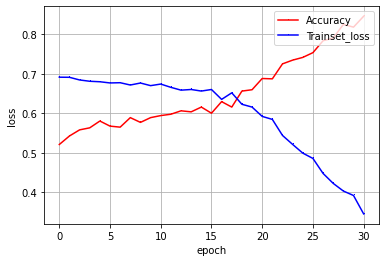
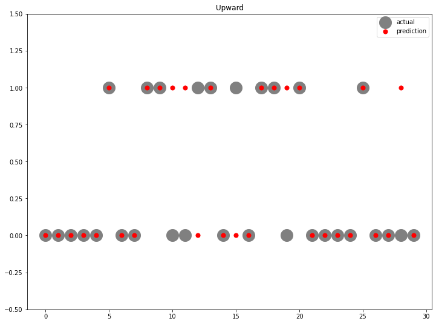

# Bitcoin GRU Price Direction Prediction

Portfolio cleanup of an exploratory project for predicting the next Bitcoin price direction with market, macro, and on-chain indicators.

The main experiment converts daily Bitcoin movement into a binary `Up/Down` target, builds 7-day sliding windows, and trains a stacked GRU classifier.

## Results Snapshot

Original notebook results:

| Experiment | Test Accuracy | Notes |
| --- | ---: | --- |
| GRU without premium/gold features | 0.80 | Main cleaned notebook result |
| GRU with selected variables | 0.63 | Feature-selection experiment |
| GRU with all variables | 0.73 | Full feature table experiment |

| Training history | Prediction check |
| --- | --- |
|  |  |

## Repository Structure

```text
.
├── assets/
│   ├── gru_prediction_scatter.png
│   └── gru_training_history.png
├── data/
│   ├── README.md
│   └── sample_real_final_data.csv
├── notebooks/
│   ├── 01_gru_price_direction_prediction.ipynb
│   └── 02_feature_selection.ipynb
├── scripts/
│   ├── fetch_binance_ohlcv.py
│   ├── fetch_cryptoquant_metric.py
│   ├── fetch_naver_gold_prices.py
│   └── fetch_upbit_ohlcv.py
├── src/
│   ├── bitcoin_data.py
│   ├── feature_selection.py
│   └── train_gru_direction.py
├── .env.example
├── LICENSE
├── README.md
└── requirements.txt
```

## Quick Start

Install dependencies:

```bash
pip install -r requirements.txt
```

Run a small smoke-test training job with the included sample:

```bash
python src/train_gru_direction.py --data data/sample_real_final_data.csv --epochs 2 --plot-dir outputs
```

Run the feature-selection helper:

```bash
python src/feature_selection.py --data data/sample_real_final_data.csv --model rf
```

For the full experiment, place the complete processed dataset at `data/real_final_data.csv` and pass it to the training script:

```bash
python src/train_gru_direction.py --data data/real_final_data.csv --encoding cp949
```

## Data Sources

The original exploratory dataset merged signals from:

- Upbit KRW-BTC OHLCV data
- Binance BTC/USDT OHLCV data
- CryptoQuant on-chain indicators
- Naver Finance gold-price data
- exchange-rate and CPI tables
- derived technical indicators such as RSI, MACD, Bollinger Bands, and moving averages

Raw data and full merged datasets are intentionally kept out of Git. The old crawler files also contained a hardcoded API token, so they were replaced with cleaned scripts that use local environment variables.

## Notes

This is a research/portfolio project, not financial advice. The original notebooks were exploratory, so the cleaned scripts prioritize reproducibility, explicit paths, and safe credential handling over preserving every scratch-cell experiment.

## License

This project is licensed under the MIT License.
